# 数据结构与算法

## 1. 排序算法

### 1.1冒泡排序 O(n)

- 方法1

  ```java
  public void bubbleSort(int[] arr){
      if(arr == null || arr.length < 2){
          return;
      }
      for(int i = 1; i < arr.length; i++){
          for(int j = i - 1; j >= 0 && arr[j] > arr[j + 1]; j--){
              swap(arr, j, j + 1);
          }
      }
  }
  ```

- 方法2

  ```java
  public void bubbleSort(int[] arr){
      int j = arr.length - 1;
      while(j != 0){
          int x = 0;
          for(int i = 0; i < j; i++){
              if(arr[i] > arr[i + 1]){
                  int t = a[i];
                  a[i] = a[i + 1];
                  a[i + 1] = t;
                  x = i;
              }
          }
          j = x;
      }
  }
  ```

### 1.2 选择排序 O(n)

- 每轮都找出它最大或者最小的元素，将其插入合适的位置

  ```java
  public void sort(int[] arr){
      if (arr == null || arr.length < 2) {
          return;
      }
      System.out.println("选择排序,时间复杂度为O(N^2),额外空间复杂度为O(1),无稳定性");
      for (int left = 0; left < arr.length; left++) {
          int min = left;
          for (int i = left + 1; i < arr.length; i++) {
              if (arr[i] < arr[min]) {
                  min = i;
              }
          }
          if (min != left) {
              swap(arr, min, left);
          }
      }
  }
  ```

### 1.3 插入排序 O(n)

```java
	public static void main(String[] args) {
		int[] arr = { 1, 3, 5, 23, 45, 11, 32 };
		for (int low = 1; low < arr.length; low++) {
			int t = arr[low];
			int i = low - 1;
			while (i >= 0 && arr[i] > t) {
				arr[i + 1] = arr[i];
				i--;
			}
			if (i != low - 1) {
				arr[i + 1] = t;
			}
		}
		System.out.println(Arrays.toString(arr));
	}
```

### 1.4 归并排序 O(log(n))

```java
// 归并排序
public class MergeSort {

	public static void main(String[] args) {
		// TODO Auto-generated method stub
		int[] arr = { 1, 4, 8, 324, 87, 2, 832, 0 };
		sort(arr);
		System.out.println(Arrays.toString(arr));
	}

	public static void sort(int[] arr) {
		if (arr == null || arr.length < 2) {
			return;
		}
		spilt(arr, 0, arr.length - 1);
	}

	private static void spilt(int[] arr, int left, int right) {
		// TODO Auto-generated method stub
		if (left == right)
			return;
		int m = left + ((right - left) >> 1);
		spilt(arr, left, m);
		spilt(arr, m + 1, right);
		merge(arr, left, m, right);
	}

	private static void merge(int[] arr, int left, int m, int right) {
		// TODO Auto-generated method stub
		int[] help = new int[right - left + 1];
		int k = 0; // 定义新数组指针
		int p1 = left;
		int p2 = m + 1;
		while (p1 <= m && p2 <= right) {
			help[k++] = arr[p1] <= arr[p2] ? arr[p1++] : arr[p2++];
		}
		while (p1 <= m) {
			help[k++] = arr[p1++];
		}
		while (p2 <= right) {
			help[k++] = arr[p2++];
		}
		// 合并数组
		for (int i = 0; i < help.length; i++) {
			arr[i + left] = help[i];
		}
	}
}
```

#### 1.3.1 常见面试题

在一个数组中，一个数左边比它小的数的总和，叫数的小和，所有数的小和累加起来，叫数组小和。求数组小和

例子: [1,3,4.2.5]

1左边比1小的数：没有

3左边比3小的数：1

4左边比4小的数：1、3

2左边比2小的数：1

5左边比5小的数：1、3、4、2

所以数组的小和为1+1+3+1+1+3+4+2=16

```java
    /*
     在一个数组中，一个数左边比它小的数的总和，叫数的小和，所有数的小和累加起来，叫数组小和。求数组小和
        例子: [1,3,4,2,5]
        1左边比1小的数：没有
        3左边比3小的数：1
        4左边比4小的数：1、3
        2左边比2小的数：1
        5左边比5小的数：1、3、4、2
        所以数组的小和为1+1+3+1+1+3+4+2=16

        在合并时
        情况1：当左组的数 小于 右组的数，产生小和，除此之外不产生
        情况2：当左组的数 等于 右组的数，先拷贝右组的数，不产生小和
        情况3：当左组的数 大于 右组的数，直接拷贝右组的数，不产生小和
     */
    public static int getSmallSum(int[] arr) {
        if (arr == null || arr.length < 2) {
            return 0;
        }
        return process(arr, 0, arr.length - 1);
    }

    private static int process(int[] arr, int l, int r) {
        if (l == r) return 0;
        int mid = l + ((r - l) >> 1);
        return process(arr, l, mid) + process(arr, mid + 1, r) + merge(arr, l, mid, r);
    }

    private static int merge(int[] arr, int l, int mid, int r) {
        int[] help = new int[r - l + 1];
        int k = 0;
        int p1 = l;
        int p2 = mid + 1;
        int result = 0;
        while (p1 <= mid && p2 <= r) {
            // 在合并时
            // 情况1：当左组的数 小于 右组的数，产生小和，除此之外不产生
            // 情况2：当左组的数 等于 右组的数，先拷贝右组的数，不产生小和
            // 情况3：当左组的数 大于 右组的数，直接拷贝右组的数，不产生小和
            // 就是利用右边有序的特性。
            result += arr[p1] < arr[p2] ? (r - p2 + 1) * arr[p1] : 0; // 左组和右组进行比较，右组是有序的，当左组的数小于右组的数时也一定小于右组的这个数往右的所有数
            help[k++] = arr[p1] < arr[p2] ? arr[p1++] : arr[p2++];
        }
        while(p1 <= mid) {
            help[k++] = arr[p1++];
        }
        while(p2 <= r) {
            help[k++] = arr[p2++];
        }
        // 将 help[] 中的元素刷回 arr[] 中
        // 易错点
        System.arraycopy(help, 0, arr, l, help.length);
        return result;
    }

```

#### 1.3.2 归并排序的用途以及思路

##### 用途

1. 求左边的数比右边的数小或者大时，可以用递归。

##### 思路

```
实质上是利用了归并排序右边一定有序的特点，将 O(N) 时间复杂度变为 O(log(n))
1 1 1 2 2 2 3 5 | 1 1 2 2 3 6 6   求逆序对(x,y) x>y 且 , p1,p2 为指针
	  p1		  p2
集数:p4  1:43:52
```


### 1.5 快速排序

- Partition 过程

  给定一个数组arr，和一个整数num。请把小于等于num的数放在数组的左边，大于num的数放在数组的右边。
  要求额外空间复杂度O(1)，时间复杂度O(N) 

  思路：

  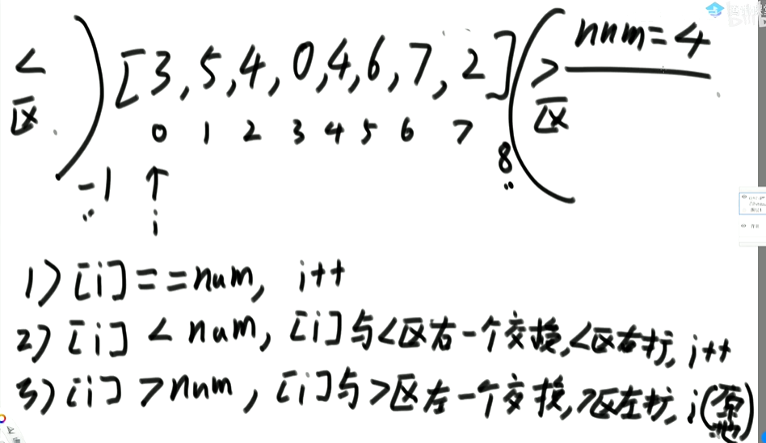

  ```java
    public static void quickSort(int[] arr) {
          if (arr == null || arr.length < 2) {
              return;
          }
          partition(arr, 0, arr.length - 1);
      }
  
      private static void partition(int[] arr, int L, int R) {
          if (L >= R) {
              return;
          }
          // 这一步使得快排的时间复杂度从 O(n^2) -> O(log(n) * n)
          swap(arr, L + (int) (Math.random() * (R - L + 1)), R);
          int[] equalArea = netherlandsFlag(arr, L, R);
          partition(arr, L, equalArea[0] - 1);
          partition(arr, equalArea[1] + 1, R);
      }
  
      // 求大于基准点的左边界和小于基准点的右边界
      public static int[] netherlandsFlag(int[] arr, int L, int R) {
          if (L > R) {
              return new int[]{-1, -1};
          }
          if (L == R) {
              return new int[]{L, R};
          }
          int less = L - 1;
          int more = R;
          int index = L;
          while (index < more) {
              if (arr[index] < arr[R]) {
                  swap(arr, index++, ++less);
              } else if (arr[index] > arr[R]) {
                  swap(arr, index, --more);
              } else {
                  index++;
              }
          }
          swap(arr, more, R);
          return new int[]{less + 1, more};
      }
  
      private static void swap(int[] arr, int i, int j) {
          int t = arr[i];
          arr[i] = arr[j];
          arr[j] = t;
      }
  ```

#### 1.5.1 随机快排的时间复杂度分析

1) 通过分析知道，划分值越靠近中间，性能越好；越靠近两边，性能越差
2) 随机选一个数进行划分的目的就是让好情况和差情况都变成概率事件
3) 把每一种情况都列出来，会有每种情况下的时间复杂度，但概率都是1/N
4) 那么所有情况都考虑，时间复杂度就是这种概率模型下的长期期望!

​	时间复杂度O(N*logN)，额外空间复杂度O(logN)都是这么来的。


### 1.6 堆排序

1. 先让整个数组都变成大根堆结构，建立堆的过程:
   1) 从上到下的方法，时间复杂度为O(N * logN)
   2) 从下到上的方法，时间复杂度为O(N)
2. 把堆的最大值和堆末尾的值交换，然后减少堆的大小之后，再去调整堆，一直周而复始，时间复杂度为O(N * logN)
3. 堆的大小减小成0之后，排序完成

```java
package com.hyx.sort;

import java.util.Arrays;

public class HeapSort {

	// 堆排序
	public static void main(String[] args) {
		int[] arr = { 3, 4, 56, 71, 36, 3, 58, 3, 8 };
		heapSort(arr);
		System.out.println(Arrays.toString(arr));
	}

	/**
	 * 先建堆，堆排序额外空间复杂度O(1),时间复杂度 O(N)
	 * 
	 * @param arr
	 */
	public static void heapSort(int[] arr) {
		if (arr == null || arr.length < 2) {
			return;
		}
		// O(N*logN) 建立大顶堆
//		for (int i = 0; i < arr.length; i++) {
//			heapInsert(arr, i);
//		}

		// O(N)
		// 让每一个节点都执行堆化,成为大顶堆
		for (int i = arr.length / 2 - 1; i >= 0; i--) {
			heapify(arr, i, arr.length);
		}
		// 进行排序操作
		int heapSize = arr.length;
//		swap(arr, 0, --heapSize);
		// O(N*logN)
		while (heapSize > 0) {
			// 下潜
			swap(arr, 0, --heapSize);
			heapify(arr, 0, heapSize);
		}
	}

	/**
	 * 下潜
	 * 
	 * @param arr
	 * @param index
	 * @param heapSize
	 */
	private static void heapify(int[] arr, int index, int heapSize) {
		int left = index * 2 + 1;
		while (left < heapSize) {
			// 右孩子赢的可能 1.右孩子存在 2.右孩子大于左孩子
			int largest = left + 1 < heapSize && arr[left + 1] > arr[left] ? left + 1 : left;
			// 将较大的孩子和父亲进行比较
			largest = arr[index] > arr[largest] ? index : largest;
			// 说明父亲比两个孩子大,则不用进行换位,直接退出
			if (largest == index) {
				break;
			}
			// 执行到这里,说明孩子比父亲大,进行交换
			swap(arr, index, largest);
			index = largest;
			left = index * 2 + 1;
		}
	}

	/**
	 * 每次插入都保持大顶堆的特性
	 * 
	 * @param arr
	 * @param index
	 */
	private static void heapInsert(int[] arr, int index) {
		while (arr[index] > arr[(index - 1) / 2]) {
			swap(arr, index, (index - 1) / 2);
			index = (index - 1) / 2;
		}
	}

	private static void swap(int[] arr, int i, int j) {
		int t = arr[i];
		arr[i] = arr[j];
		arr[j] = t;
	}

}

```


#### 1.6.1 比较器

1. 比较器的实质就是重载比较运算符
2. 比较器可以很好的应用在特殊标准的排序上
3. 比较器可以很好的应用在根据特殊标准排序的结构上
4. 写代码变得异常容易，还用于泛型编程


### 1.7 不基于比较的排序

桶排序思想下的排序:计数排序 & 基数排序

1) 桶排序思想下的排序都是不基于比较的排序
2) 时间复杂度为O(N)，额外空间负载度O(M)
3) 应用范围有限，需要样本的数据状况满足桶的划分

- 计数排序和基数排序 
  1) 一般来讲，计数排序要求，样本是整数，且范围比较窄
  2) 一般来讲，基数排序要求，样本是10进制的正整数
  3) 一旦要求稍有升级，改写代价增加是显而易见的

- 基数排序

  ```java
  public class RadixSort {
      public static void main(String[] args) {
          int[] arr = {213, 4, 2, 54, 2, 1, 5, 1, 9, 7};
          radixSort(arr);
          System.out.println(Arrays.toString(arr));
      }
  
      public static void radixSort(int[] arr) {
          if (arr == null || arr.length < 2) {
              return;
          }
          radixSort(arr, 0, arr.length - 1, maxbits(arr));
      }
  
      /**
       * 求最高位
       *
       * @param arr
       * @return
       */
      private static int maxbits(int[] arr) {
          int max = Integer.MIN_VALUE;
          for (int i = 0; i < arr.length; i++) {
              max = Math.max(max, arr[i]);
          }
          int res = 0;
          while (max != 0) {
              res++;
              max /= 10;
          }
          return res;
      }
  
      /**
       * @param arr   arr
       * @param L     最左侧的索引位置
       * @param R     最右侧的索引位置
       * @param digit 最高位数
       */
      private static void radixSort(int[] arr, int L, int R, int digit) {
          final int radix = 10; // 十进制的数以十为基底
          int i = 0, j = 0;
          // 有多少个数准备多少个辅助空间
          int[] help = new int[R - L + 1];
          // 有多少位就进出几次
          for (int d = 1; d <= digit; d++) {
              // 10 个空间
              // count[0] 当前位(d位)是0的数字有多少个
              // count[1] 当前位(d位)是(0和1)的数字有多少个
              // count[2] 当前位(d位)是(0、1和2)的数字有多少个
              // count[i] 当前位(d位)是(0~i)的数字有多少个
              int[] count = new int[radix];
              // 这个循环统计 arr 在 d 位中出现的次数，用 count 数组收集
              for (i = L; i <= R; i++) {
                  // 103 1  3
                  // 209 1  9
                      j = getDigit(arr[i], d);
                  count[j]++;
              }
              // 求前缀和
              for (i = 1; i < radix; i++) {
                  count[i] = count[i] + count[i - 1];
              }
              // 创建一个 help 数组，对 arr 从右向左读个位，根据 count` 的次数判断位置，并向 help 中写入数据
              for (i = R; i >= L; i--) {
                  j = getDigit(arr[i], d);
                  help[count[j] - 1] = arr[i];
                  count[j]--;
              }
              for (i = L, j = 0; i <= R; i++, j++) {
                  arr[i] = help[j];
              }
          }
  
      }
  
      // 用于提取一个整数 x 中第 d 位的数字。
      private static int getDigit(int x, int d) {
          return ((x / ((int) Math.pow(10, d - 1))) % 10);
      }
  }
  
  /*
  radixSort() 方法的原理：
  arr = [101, 200, 012, 011, 202, 403]
  求个位时
      使用普通桶排序时的顺序：(这样就创建了十个桶)
          [200, 101, 011, 012, 202, 403]
  
  优化：1、新建一个长度为 10 的数组，统计个位出现次数
      count[1 2 2 1 0 0 0 0 0 0]      个位 == i 有几个
            0 1 2 3 4 5 6 7 8 9
      2、创建一个 count` 统计数组出现次数的前缀和
      count`[1 3 5 6 6 6 6 6 6 6]     个位 <= i 有几个
             0 1 2 3 4 5 6 7 8 9
      3、创建一个 help 数组，对 arr 从右向左读个位，根据 count` 的次数判断位置，并向 help 中写入数据
      count`[0 1 3 5 6 6 6 6 6 6]
             0 1 2 3 4 5 6 7 8 9
  
      help [200 101 011 012 202 403]
             0   1   2   3   4   5
  
  问题：
      步骤 2 中为什么要从右向左读取？
      因为前缀和求得是一个大致范围 开头不确定，这样也可以保证稳定性
  
  求其他位置，以此类推
  
   */
  ```

  

### 1.8 排序算法的稳定性

稳定性是指同样大小的样本再排序之后不会改变相对次序

对基础类型来说，稳定性毫无意义

对非基础类型来说，稳定性有重要意义

有些排序算法可以实现成稳定的，而有些排序算法无论如何都实现不成稳定的

- 总结

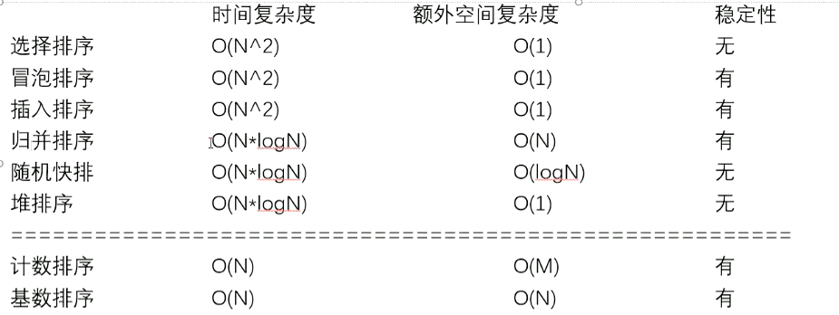


### 1.9 排序算法总结

1) 不基于比较的排序，对样本数据有严格要求，不易改写
2) 基于比较的排序，只要规定好两个样本怎么比大小就可以直接复用
3) 基于比较的排序，时间复杂度的极限是O(N*logN)
4) 时间复杂度O(N*logN)、额外空间复杂度低于O(N)、且稳定的基于比较的排序是不存在的。
5) 为了绝对的速度选快排、为了省空间选堆排、为了稳定性选归并

- 常见的坑

  1. 归并排序的额外空间复杂度可以变成O(1),“归并排序 内部缓存法"，但是将变得不再稳定。
  2. "原地归并排序"是垃圾贴，会让时间复杂度变成O(N^2)
  3. 快速排序稳定性改进，“01stable sort”，但是会对样本数据要求更多

  在整型数组中，请把奇数放在数组左边，偶数放在数组右边，要求所有奇数之间原始的相对次序不变，所有偶数之间原始相对次序不变。时间复杂度做到O(N)，额外空间复杂度做到O(1)

  这种题目就是故意为难面试者，因为快排的 partition 是不保证稳定性的。

- 工程上对排序的改进

  1. 稳定性的考虑
  2. 充分利用O(N*logN) 和 O(N^2) 排序各自的优势。

 

## 2. 查找

### 2.1 认识二分法

1. 在一个有序数组中，找某个数是否存在

   ```java
   public boolean exist(int[] sortedArr, int num){
       if(sortedArr == null || sortedArr.length == 0){
           return false;
       }
       int L = 0;
       int R = sortedArr.length - 1;
       int mid = 0;
       while(L < R){
           mid = L + ((R - L) >> 1); // mid = (L + R) / 2
           if(sortedArr[mid] == num){
               return true;
           } else if (sortedArr[mid] > num){
               R = mid - 1;
           } else {
               L = mid + 1;
           }
       }
       return sortedArr[L] == num;
   }
   ```

2. 在一个有序数组中， 找 >= 某个数最左侧的位置

   ```java
   public int nearestIndex(int[] arr,int value){
       int L = 0;
       int R = arr.length - 1;
       int index = -1; // 记录最左的对号
       while(L <= R){
           int mid = L + ((R - L) >> 1);
           if (arr[mid] >= value){
               index = mid;
               R = mid - 1;
           } else {
               L = mid + 1;
           }
       }
       return index;
   }
   ```

3. 在一个有序数组中，找 <= 某个数最右侧的位置

   ```java
   public int nearestIndex(int[] arr,int value){
       int L = 0;
       int R = arr.length - 1;
       int index = -1;
       while(L <= R){
           int mid = L + ((R - L) >> 1);
           if(arr[mid] <= value){
               index = mid;
               R = mid + 1;
           } else {
               L = mid - 1;
           }
       }
   }
   ```

4. 局部最小值问题

   - 逻辑二分：满足一个条件把另一侧全部排除掉的选项就可以二分。
   - 三种情况：n 长度的数组 
     1. 如果 0 索引处的值 小于1 索引处的值，由于 0 的左侧没有元素，则 0 索引处为局部最小。
     2. 如果 n-2 索引处的值 小于 n-1 索引处的值，由于 n-1 的右侧没有元素，则 n-1 索引处为局部最小。
     3. 如果不符合前两种情况，那么在中间就一定有至少一个最小值。

   ```java
   public static int getLessIndex(int[] arr){
       if(arr == null || arr.length == 0){
           return -1;
       }
       if(arr.length == 1 || arr[0] < arr[1]){
           return 0;
       }
       if(arr[arr.length - 1] < arr[arr.length - 2]){
           return arr[arr.length - 1];
       }
       int left = 1;
       int right = arr.length - 2;
       int mid = 0;
       while(left < right){
           mid = (left + rigth) >> 1;
           if(arr[mid] > arr[mid - 1]){
               right = mid - 1;
           } else if(arr[mid] > arr[mid + 1]){
               left = mid + 1;
           } else {
               return mid;
           }
       }
       return left;
   }
   ```

   

- 认识异或运算

  异或运算：相同为0，不同为1

  同或运算：相同以1，不同为0

  诀窍：异或运算就记成无进位相加！

  1. 0^N == N 		N^N == 0
  2. 异或运算满足交换律和结合律

  - 题目一

    完成两个数的交换，不借助其他变量（这种方法，只适用于交换的两个值内存区域的位置不同），不然自己与自己异或会变成0。

    ```java
    int a = 甲		int b = 乙
    a = a ^ b	a = 甲 ^ 乙	b = 乙
    b = a ^ b	a = 甲 ^ 乙	b = 甲 ^ 乙 ^ 乙 = 甲
    a = a ^ b	a = 甲 ^ 乙 ^ 甲 = 乙	b = 甲
    ```

  - 题目二

    一个数组中有一种数出现了奇数次，其他数都出现了偶数次，怎么找到并打印这种数。

    ```java
    // 直接异或
    int eor = 0;
    int[] a;
    // eor 异或 a, 只有奇数次的数留了下来
    ```

  - 题目三

    怎么把一个int类型的数，提取出最右侧的1来。

    一个数和它的补码 & 就能提取出最右侧的1来。

    ```java
    N & ((~N) + 1)
    ```

  - 题目四

    一个数组中有两种数出现了奇数次，其他数都出现了偶数次，怎么找到并打印这两种数。

    ```java
    	// arr中，有两种数，出现奇数次
        public static void main(String[] args) {
            int[] arr = {3, 3, 5, 5, 1, 1, 9, 8, 1, 1};
            // 9 : 00001001
            // 8 : 00001000
            // 8^9:00000001 = eor
            printOddTimesNum2(arr);
        }
    
        public static void printOddTimesNum2(int[] arr) {
            int eor = 0;
            for (int i = 0; i < arr.length; i++) {
                eor ^= arr[i];
            }
            // 此时 eor = a ^ b
            // eor != 0
            // eor必然有一个位置上是1
            // 011010000
            // 000010000
            int rightOne = eor & (~eor + 1); // 一个数和它的补码 & 就能提取出最右侧的1来。
            int onlyOne = 0; // eor'
            for (int i = 0; i < arr.length; i++) {
                if ((arr[i] & rightOne) != 0) {
                    onlyOne ^= arr[i];
                }
            }
            System.out.println(onlyOne + " " + (eor ^ onlyOne));
        }
    ```


## 3. 基本数据结构

### 3.1 链表

#### 3.1.1 面试时链表解题的方法论

1. 对于笔试，不用太在乎空间复杂度，一切为了时间复杂度
2. 对于面试，时间复杂度依然放在第一位，但是一定要找到空间最省的方法


#### 3.1.2 链表面试题常用数据结构和技巧

1. 使用容器（哈希表、数组等）
2. 快慢指针

##### 快慢指针

1. 输入链表头节点，奇数长度返回中点，偶数长度返回上中点

   ```java
   public static Node midOrUpMidNode(Node head) {
   	if (head == null || head.next == null || head.next.next == null) {
   		return head;
   	}
   	// 链表有三个点或以上
   	Node slow = head.next;
   	Node fast = head.next.next;
   	while (fast.next != null && fast.next.next != null) {
   		slow = slow.next;
   		fast = fast.next.next;
   	}
   	return slow;
   }
   ```

2. 输入链表头节点，奇数长度返回中点，偶数长度返回下中点

   ```java
   public static Node midOrDownMidNode(Node head) {
   		if (head == null || head.next == null) {
   			return head;
   		}
   		// 链表有两个点或以上
   		Node slow = head.next;
   		Node fast = head.next;
   		while (fast.next != null && fast.next.next != null) {
   			slow = slow.next;
   			fast = fast.next.next;
   		}
   		return slow;
   	}
   ```

3. 输入链表头节点，奇数长度返回中点前一个，偶数长度返回上中点前一个

   ```java
   public static Node midOrUpMidPreNode(Node head) {
   	if (head == null || head.next == null || head.next.next == null) {
   		return null;
   	}
   	// 三个元素及以上
   	Node slow = head;
   	Node fast = head.next.next;
   	while (fast.next != null && fast.next.next != null) {
   		slow = slow.next;
   		fast = fast.next.next;
   	}
   	return slow;
   }
   ```

4. 输入链表头节点，奇数长度返回中点前一个，偶数长度返回下中点前一个

   ```java
   public static Node midOrDownMidPreNode(Node head) {
   	if (head == null || head.next == null) {
   		return null;
   	}
   	Node slow = head;
   	Node fast = head.next;
   	while (fast.next != null && fast.next.next != null) {
   		slow = slow.next;
   		fast = fast.next.next;
   	}
   	return slow;
   }
   ```


- 给定一个单链表的头节点head，请判断该链表是否为回文结构。

  1) 栈方法特别简单(笔试用)

  2) 改原链表的方法就需要注意边界了(面试用)

     ```java
     // 将方法1的步骤1和步骤2进行合并，在一次循环里既找到中间点，也把前半个链表进行反转。
     // 然后进行步骤3 ，比较两个链表
     class Solution {
         public boolean isPalindrome(ListNode head) {
             /*
                 步骤1:找中间点的同时反转前半个链表
                 步骤2:反转的前半个链表 与 中间点开始的后半个链表 逐一比较
             */
             // 快慢指针法求得链表的中间位置
             ListNode p1 = head; // 慢
             ListNode p2 = head; // 快
             ListNode n1 = null; // 新链表的头
             ListNode o1 = head; // 旧头
             // ListNode o2 = null; 
             while(p2 != null && p2.next != null){
                 p1 = p1.next;
                 p2 = p2.next.next;
                 // 在循环里进行前半部分的链表反转
                 // o2 = o1.next; // 旧老二
                 o1.next = n1;
                 n1 = o1;
                 o1 = p1; // 因为 o2 和 p1 走的步是一样的，可以简化
             }
             // 为什么要判断它是奇数节点，因为当它是奇数节点时，前面的链表长度 要小于 后面链表的长度
             // 怎么说明它是奇数节点，
             /*
                         p1
                                     p2
             1     2     3     2     null            偶数的情况下 p2 最后指向null
             
                         p1
                                     p2
             1     2     3     2     1    null       奇数的情况下 p2 最后指向 尾节点
             */
             if(p2 != null){ // 说明它是奇数节点
                 p1 = p1.next;
             }
     
             // 步骤2:反转的前半个链表 与 中间点开始的后半个链表 逐一比较
             while(n1 != null){
                 if(n1.val != p1.val){
                     return false;
                 }
                 n1 = n1.next;
                 p1 = p1.next;
             }
             return true;
         }
     }
     ```


- 将单向链表按某值划分成左边小、中间相等、右边大的形式

  1) 把链表放入数组里，在数组上做partition(笔试用)

     ```java
     public static Node listPartition(Node head, int pivot) {
     		if (head == null) {
     			return null;
     		}
     		Node cur = head;
     		int i = 0;
     		while (cur != null) {
     			i++;
     			cur = cur.next;
     		}
     		Node[] nodeArr = new Node[i];
     		i = 0;
     		cur = head;
     		for (i = 0; i != nodeArr.length; i++) {
     			nodeArr[i] = cur;
     			cur = cur.next;
     		}
     		arrPartition(nodeArr, pivot);
     		for (i = 1; i != nodeArr.length; i++) {
     			nodeArr[i - 1].next = nodeArr[i];
     		}
     		nodeArr[i - 1].next = null;
     		return nodeArr[0];
     	}
     
     	// 在对数组进行快排
     	private static void arrPartition(Node[] nodeArr, int pivot) {
     		int small = -1;
     		int big = nodeArr.length;
     		int index = 0;
     		while (index != big) {
     			if (nodeArr[index].value < pivot) {
     				swap(nodeArr, ++small, index++);
     			} else if (nodeArr[index].value == pivot) {
     				index++;
     			} else {
     				swap(nodeArr, index, --big);
     			}
     		}
     	}
     
     	private static void swap(Node[] nodeArr, int i, int j) {
     		Node temp = nodeArr[i];
     		nodeArr[i] = nodeArr[j];
     		nodeArr[j] = temp;
     	}
     ```

     

  2) 分成小、中、大三部分，再把各个部分之间串起来(面试用)

     ```java
     	public static Node listPartition2(Node head, int pivot) {
     		Node sH = null; // small head
     		Node sT = null; // small tail
     		Node eH = null; // equal head
     		Node eT = null; // equal tail
     		Node mH = null; // big head
     		Node mT = null; // big tail
     		Node next = null; // save next node
     		// every node distributed to three lists
     		while (head != null) {
     			next = head.next;
     			head.next = null;
     			if (head.value < pivot) {
     				if (sH == null) {
     					sH = head;
     					sT = head;
     				} else {
     					sT.next = head;
     					sT = head;
     				}
     			} else if (head.value == pivot) {
     				if (eH == null) {
     					eH = head;
     					eT = head;
     				} else {
     					eT.next = head;
     					eT = head;
     				}
     			} else {
     				if (mH == null) {
     					mH = head;
     					mT = head;
     				} else {
     					mT.next = head;
     					mT = head;
     				}
     			}
     			head = next;
     		}
     		// 小于区域的尾巴 连等于区域的头；等于区域的尾巴 连大于区域的头
     		if (sT != null) { // 如果有小于区域
     			sT.next = eH;
     			eT = eT == null ? sT : eT;// 下一步，谁去连大于区域的头，谁就变成e
     		}
     		// 上面的 if 不管跑了没有，et
     		if (eT != null) { // 如果小于区域和等于区域不是都没有
     			eT.next = mH;
     		}
     		return sH != null ? sH : (eH != null ? eH : mH);
     	}
     ```

- 一种特殊的单链表节点类描述如下
  ```java
  class Node {
      int value;
      Node next;
      Node rand;
      Node(int yal) { value = val; }
  }
  ```

  rand指针是单链表节点结构中新增的指针，rand可能指向链表中的任意一个节点，也可能指向null。
  **给定一个由Node节点类型组成的无环单链表的头节点 head，请实现一个函数完成这个链表的复制，并返回复制的新链表的头节点。**
  【要求】时间复杂度O(N)，额外空间复杂度O(1)

  ```java
      /**
       * 使用 hash 表解决
       *
       * @param head 头节点
       * @return Node
       */
      public static Node CopyListWithRand1(Node head) {
          HashMap<Node, Node> map = new HashMap<>();
          Node cur = head;
          // 将所有的节点都拷贝一份
          while (cur != null) {
              map.put(cur, new Node(cur.value));
              cur = cur.next;
          }
          cur = head;
          while (cur != null) {
              // 将克隆出来的节点指针，分别指向 next 和 rand
              map.get(cur).next = map.get(cur.next);
              map.get(cur).rand = map.get(cur.rand);
              cur = cur.next;
          }
          return map.get(head);
      }
  ```

  - 方法2，优化

  ```java
      // 核心：就是人为的将 节点对象 和 克隆节点 制造了对应关系
      /**
       * @param head 头节点
       * @return Node
       */
      public static Node CopyListWithRand2(Node head) {
          if (head == null) {
              return null;
          }
          // 将每一个节点进行克隆，并插入到被克隆节点的后面 1 -> 1' -> 2 -> 2'
          Node cur = head;
          Node next = null;
          while (cur != null) {
              next = cur.next;
              cur.next = new Node(cur.value);
              cur.next.next = next;
              cur = next;
          }
          cur = head;
          Node curCopy = null;
          // set copy node rand
          // 1 -> 1' -> 2 -> 2'
          // 先搞定克隆节点的 rand 指针
          while (cur != null) {
              // cur 老
              // cur.next 新 copy
              next = cur.next.next;
              // 将克隆的 rand 指针指向 被克隆节点的 rand 的克隆节点的 rand 指针
              curCopy = cur.next;
              curCopy.rand = cur.rand != null ? cur.rand.next : null; // cur.rand.next : 这样就灵活的使用了对应关系
              cur = next;
          }
          // head
          Node res = head.next;
          cur = head;
          // split rand指针不用动，只需要分离 next 指针
          while (cur != null) {
              next = cur.next.next;
  
              curCopy = cur.next;
              cur.next = next;
              curCopy.next = next != null ? next.next : null;
  
              cur = next;
          }
          return res;
      }
  ```


- 两个链表入环节点的问题

  给定两个可能有环也可能无环的单链表，头节点head1和head2。
  请实现一个函数，如果两个链表相交，请返回相交的第一个节点。如果不相交，返回null。

  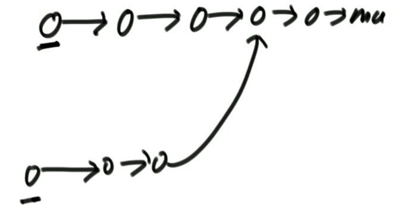

  【要求】
  如果两个链表长度之和为N，时间复杂度请达到O(N)，额外空间复杂度 请达到O(1)。

  思路：

  1. 首先判断链表是否有环

  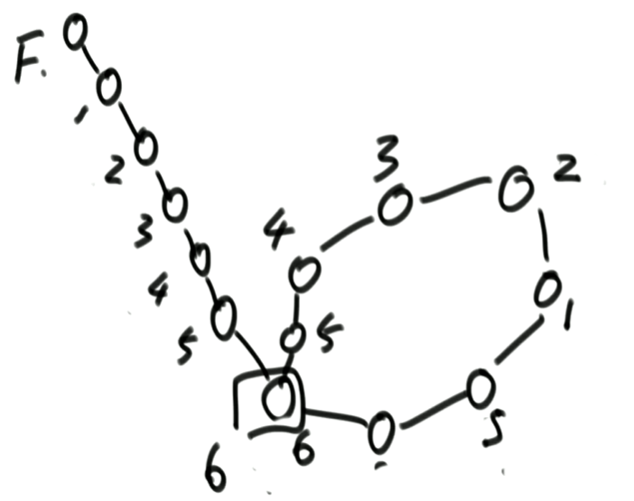

  

  2. 如果两个链表无环，如果相交了，它们一定有公共部分，end 处必定相交。

  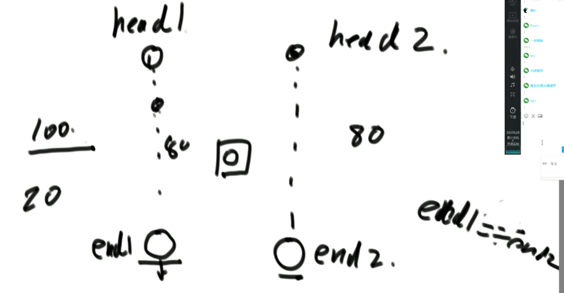

  3. 一个链表有环，一个链表无环，这种情况是不可能发生的。

  4. 两个链表都有环

     1. 两个链表都有环，是独立不相交的

     2. 两个链表都有环，它们的入环节点是一样的

        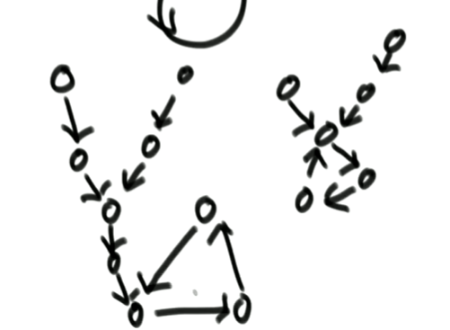

     3. 两个链表都有环，它们的入环节点是不一样

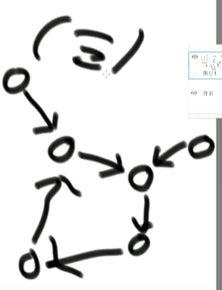

实际上是三道面试题的合集：

1. 给我一个链表，返回一个的入环的节点。
2. 两个无环链表相交，返回一个相交的节点。
3. 两个有环链表怎么找到相交的节点。

```java
public class Code04_FindFirstIntersectNode {

	public static class Node {
		int value;
		Node next;

		Node(int val) {
			value = val;
		}
	}

	public static Node getIntersectNode(Node head1, Node head2) {
		if (head1 == null || head2 == null) {
			return null;
		}
		Node loop1 = getLoopNode(head1);
		Node loop2 = getLoopNode(head2);
		if (loop1 == null && loop2 == null) {
			// 两个链表都无环
			return noLoop(head1, head2);
		}
		if (loop1 != null && loop2 != null) {
			// 两个链表都有环
			return bothLoop(head1, loop1, head2, loop2);
		}
		return null;
	}

	// 两个有环链表，返回第一个相交界点，如果不相交返回 null
	// 1.两个独立的成环链表，不相交
	// 两个成环链表相交，它们一定是共用环的
	// 2.两个成环链表，入环节点是同一个 loop1 == loop2,说明可以不用看环了
	// 3.两个成环链表，入环节点不是同一个 loop1 != loop2

	// 两个有环链表,返回第一个相交节点，如果不相交返回 null
	public static Node bothLoop(Node head1, Node loop1, Node head2, Node loop2) {
		Node cur1 = null;
		Node cur2 = null;
		// 情况2
		if (loop1 == loop2) {
			cur1 = head1;
			cur2 = head2;
			int n = 0;
			while (cur1 != loop1) {
				n++;
				cur1 = cur1.next;
			}
			while (cur2 != loop2) {
				n--;
				cur2 = cur2.next;
			}
			cur1 = n > 0 ? head1 : head2;
			cur2 = cur1 == head1 ? head2 : head1;
			n = Math.abs(n);
			while (n != 0) {
				n--;
				cur1 = cur1.next;
			}
			while (cur1 != cur2) {
				cur1 = cur1.next;
				cur2 = cur2.next;
			}
			return cur1;
		} else {
			// 情况3
			cur1 = loop1.next;
			while (cur1 != loop1) {
				if (cur1 == loop2) {
					return loop1;
				}
				cur1 = cur1.next;
			}
			return null;
		}
	}

	// 如果两个链表都无环，返回第一个相交节点，如果不相交，返回 null
	public static Node noLoop(Node head1, Node head2) {
		if (head1 == null || head2 == null) {
			return null;
		}
		Node cur1 = head1;
		Node cur2 = head2;
		int n = 0;
		while (cur1.next != null) {
			n++;
			cur1 = cur1.next;
		}
		while (cur2.next != null) {
			n--;
			cur2 = cur2.next;
		}
		if (cur1 != cur2) {
			return null;
		}
		// n : 链表1长度减去链表2长度的值
		cur1 = n > 0 ? head1 : head2;// 谁长,谁的头变成 cur1
		cur2 = cur1 == head1 ? head2 : head1;// 谁短,谁的头变成 cur2
		n = Math.abs(n);
		while (n != 0) {
			n--;
			cur1 = cur1.next;
		}
		while (cur1 != cur2) {
			cur1 = cur1.next;
			cur2 = cur2.next;
		}
		return cur1;
	}

	// 找到链表第一个入环节点，如果无环，返回 null
	public static Node getLoopNode(Node head) {
		if (head == null || head.next == null || head.next.next == null) {
			return null;
		}
		// p1 慢 p2 快
		Node p1 = head.next;
		Node p2 = head.next.next;
		while (p1 != p2) {
			if (p2.next == null || p2.next.next == null) {
				return null;
			}
			p2 = p2.next.next;
			p1 = p1.next;
		}
		// p2 -> walk again from head
		// 遇到环,p1 与 p2 相遇了, p2 回到头节点一次走一步
		p2 = head;
		while (p1 != p2) {
			p1 = p1.next;
			p2 = p2.next;
		}
		return p1;
	}
}
```


- 能不能不给单链表的头节点，只给想要删除的节点，就能做到在链表上把这个点删掉?

  ```java
  
  public static class Node{
      public int value;
      public Node next;
      public Node(int v){
          value = v;
      }
  }
  public static void main(string[] args){
      Node a = new Node(1);
      Node b = new Node(2);
      Node c = new Node(3);
      a.next = b;
      b.next = c;
      c = null;
  }
  ```

  不行，必须准确的给我头节点。因为我假设 c 节点指向null，只是我 c 节点的引用指向null，但在堆中的 3 节点，仍然是链表结构。栈没了，堆还在。只是将 c 的引用置空。

  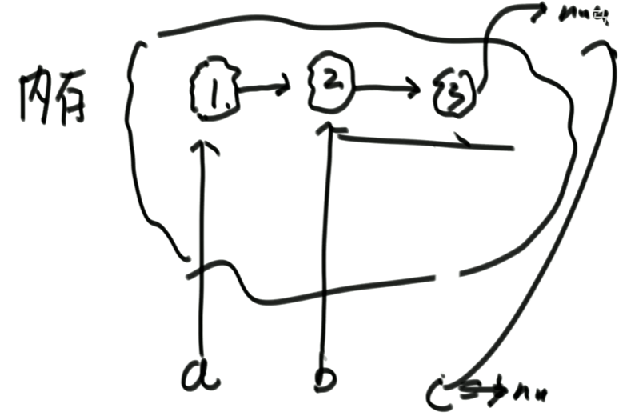


- 练习

  1. 单链表和双链表如何反转

     ```java
     public static Node reverseLinkedList(Node head){
         Node pre = null;
         Node next = null;
         while(head != null){
             next = head.next;
             head.next = pre;
             pre = head;
             head = next;
         }
         return pre;
     }
     
     public static Node reverseDoubleList(Node head){
         Node pre = null;
         Node next = null;
         while(head != null){
             next = head.next;
             head.next = pre;	// 调两个指针
             head.last = next;
             pre = head;
             head = next;
         }
         return pre;
     }
     ```

     

  2. 把给定值都删除

     ```java
     public void Node removeValue(Node node,int num){
         // 要找到头部的值第一个不为num的节点
         while(node != null){
            	if((node.value) != num){
                 break;
             }
             head = head.next;
         }
         // head来到第一个不需要删除的位置
         Node pre = head;
         Node cur = head;
         while(cur != null){
             if(cur.value == num){
                 pre.next = cur.next;
             }else{
                 pre = cur;
             }
             cur = cur.next;
         }
         return head;
     }
     ```

### 3.2 栈和队列

- 逻辑概念

  栈：数据先进后出，犹如弹匣

  队列：数据先进先出，好似排队

#### 3.2.1 常见面试题

##### 1. 怎么用数组实现不超过固定大小的队列和栈？

栈：正常使用

队列：环形数组

```java
package com.hyx2.basic_data_structure;

/**
 * @version 0.1
 * @Author hyx
 * @className MyQueue
 * @Date 2024/10/23  22:51
 * @description 用数组实现队列
 * @since jdk 11
 */
public class MyQueue {
    
    public static class MyQueue2 {
        private int[] arr;
        private int pushi;
        private int polli;
        private int size;
        private final int limit;

        public MyQueue2(int limit) {
            arr = new int[limit];
            pushi = 0;
            polli = 0;
            size = 0;
            this.limit = limit;
        }

        public void push(int value) {
            if (size == limit) {
                throw new RuntimeException("队列满了，不能再加了");
            }
            size++;
            arr[pushi] = value;
            pushi = nextIndex(pushi);
        }

        public int pop(){
            if (size == 0){
                throw new RuntimeException("队列空了，不能在拿了");
            }
            size--;
            int ans = arr[polli];
            polli = nextIndex(polli);
            return ans;
        }

        // 如果现在的下标是i，返回下一个位置
        private int nextIndex(int i) {
            return i < limit - 1 ? i + 1 : 0;
        }
    }
}
```

##### 2. 实现一个特殊的栈，在基本功能的基础上，在实现返回栈中最小元素的功能

要求：

1. pop、push、getMin操作的时间复杂度都是O(1)
2. 设计的栈类型可以使用现成的栈结构

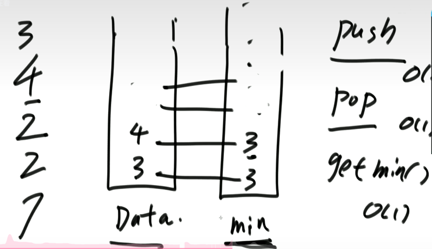

- 方法1（省时间，费空间）

  思路：新建一个`min`栈，在`Data`栈中放入数据时，同步将`min`栈中插入`Data`栈中的最小值。当每次 pop 的时候，同步进行出栈，此时`min`栈中的每次栈顶元素都是`Data`栈中元素的最小值。

```java
import java.util.Stack;
/**
 * @version 0.1
 * @Author hyx
 * @className GetMinFromStack
 * @Date 2024/10/23  23:15
 * @description
 * @since jdk 11
 */
public class GetMinFromStack {
    /*
    实现一个特殊的栈，在基本功能的基础上，在实现返回栈中最小元素的功能
        要求:
        1. pop、push、getMin操作的时间复杂度都是O(1)
        2. 设计的栈类型可以使用现成的栈结构
     */

    public static class MyStack {
        private Stack<Integer> stackData;
        private Stack<Integer> stackMin;

        public MyStack() {
            this.stackData = new Stack<>();
            this.stackMin = new Stack<>();
        }

        public void push(Integer newNum) {
            if (this.stackMin.isEmpty()){
                this.stackMin.push(newNum);
            } else if (newNum < this.getMin()) {
                this.stackMin.push(newNum);
            }else {
                int newMin = this.stackMin.peek();
                this.stackMin.push(newMin);
            }
            this.stackData.push(newNum);
        }

        public int pop(){
            if (this.stackData.isEmpty()){
                throw new RuntimeException("Your stack is empty.");
            }
            this.stackMin.pop();
            return this.stackData.pop();
        }

        private Integer getMin() {
            if (this.stackData.isEmpty()){
                throw new RuntimeException("Your stack is empty.");
            }
            return this.stackMin.peek();
        }
    }
}
```

- 方法2（省空间，费时间）

  思路：还是与方法1类似，新建一个栈，当小于等于`Data`栈顶的元素时，`Min`栈压入。当出栈时，要判断`Min`栈顶的元素是否与出栈的元素相等，如果相等，则`Min`栈顶元素出栈。

##### 3. 如果用栈结构实现队列结构？  如果用队列结构实现栈结构？

用队列结构实现栈结构：

思路：

  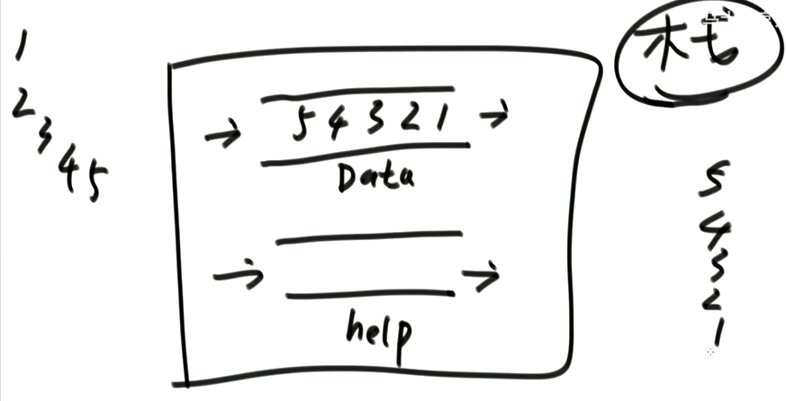

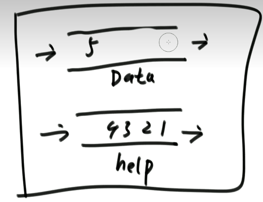

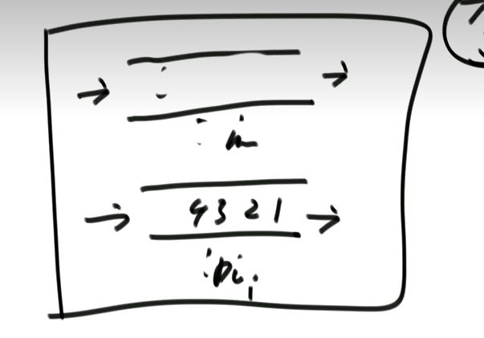

用栈结构实现队列结构：

- 思路：

  前提：1. push 栈导出到 pop 栈时，pop 栈必须为空时才能导 。

  ​			2. push 栈在导出数据时，必须将 push 栈中的数据导完。

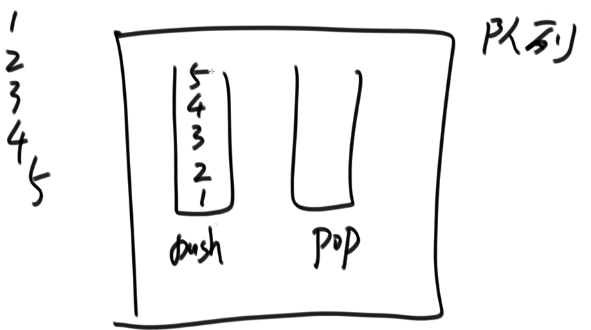

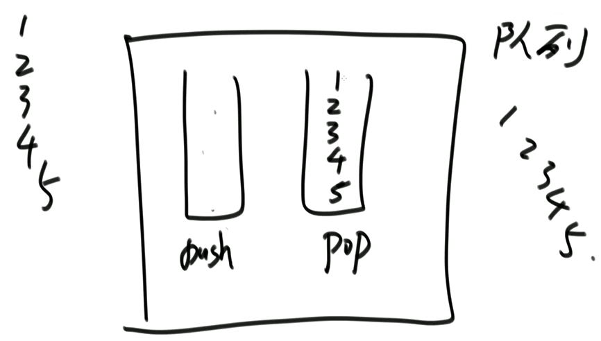

### 3.3 哈希表

1) 哈希表在使用层面上可以理解为一种集合结构。
2) 如果只有key，没有伴随数据value，可以使用HashSet结构。
3) 如果既有key，又有伴随数据value，可以使用HashMap结构。
4) 有无伴随数据，是HashMap和HashSet唯一的区别，实际结构是一回事。
5) **使用哈希表增(put)、删(remove)、改(put)和查(get)的操作，可以认为时间复杂度为O(1)**，但是常数时间比较大 。
6) 放入哈希表的东西，如果是基础类型包括`Integer` `Double` `String` `Long` 等等，内部按值传递，内存占用是这个东西的大小。
7) 放入哈希表的东西，如果不是基础类型，内部按引用传递，内存占用是8字节。


### 3.4 堆

1) 堆结构就是用数组实现的完全二叉树结构
2) 完全二叉树中如果每棵子树的最大值都在顶部就是大根堆
3) 完全二叉树中如果每棵子树的最小值都在顶部就是小根堆
4) 堆结构的heapInsert与heapify操作
5) 堆结构的增大和减少
6) 优先级队列结构，就是堆结构

- 公式：
  - 左孩子 = 2 * i + 1
  - 右孩子 = 2 * i + 2
  - 父亲节点 (i - 1) / 2


### 3.5 前缀树

1) 单个字符串中，字符从前到后的加到一棵多叉树上
2) 字符放在路上，节点上有专属的数据项(常见的是pass和end值)
3) 所有样本都这样添加，如果没有路就新建，如有路就复用
4) 沿途节点的pass值增加1，每个字符串结束时来到的节点end值增加1

可以完成前缀相关的查询

```java
package com.hyx.tree;

// 前缀树
public class Code01_TrieTree {

	public static class Node1 {
		public int pass;
		public int end;
		public Node1[] nexts;

		public Node1() {
			pass = 0;
			end = 0;
			// 0 a
			// 1 b
			// 2 c
			// ... ...
			// 25 z
			// nexts[i] = null i方向的路不存在
			// nexts[i] != null i方向的路存在
			// 沿着向下挂, 沿途节点 p++, 没有就新建, 最后一个节点 e++, 无节点新建, 有节点复用
			nexts = new Node1[26];
		}
	}

	public static class Trie1 {
		private Node1 root;

		public Trie1() {
			root = new Node1();
		}

		// 插入
		public void insert(String word) {
			if (word == null) {
				return;
			}
			char[] chs = word.toCharArray();
			Node1 node = root;
			node.pass++;
			int index = 0;
			for (int i = 0; i < chs.length; i++) { // 从左往右遍历字符
				index = chs[i] - 'a';
				if (node.nexts[index] == null) {
					node.nexts[index] = new Node1();
				}
				node = node.nexts[index];
				node.pass++;
			}
			node.end++;
		}

		// word 这个单词之前加入过几次
		public int search(String word) {
			if (word == null) {
				return 0;
			}
			char[] chs = word.toCharArray();
			Node1 node = root;
			int index = 0;
			for (int i = 0; i < chs.length; i++) {
				index = chs[i] - 'a';
				if (node.nexts[index] == null) {
					return 0;
				}
				node = node.nexts[index];
			}
			return node.end;
		}

		// 所有加入的字符串中, 有几个是以 pre 这个字符串作为前缀的
		public int prefixNumber(String pre) {
			if (pre == null) {
				return 0;
			}
			char[] chs = pre.toCharArray();
			Node1 node = root;
			int index = 0;
			for (int i = 0; i < chs.length; i++) {
				index = chs[i] - 'a';
				if (node.nexts[index] == null) {
					return 0;
				}
				node = node.nexts[index];
			}
			return node.pass;
		}

		public void delete(String word) {
			if (search(word) != 0) {
				char[] chs = word.toCharArray();
				Node1 node = root;
				node.pass--;
				int index = 0;
				for (int i = 0; i < chs.length; i++) {
					index = chs[i] - 'a';
					// 判断如果 一个节点的 --pass == 0, 那么下面的节点也就没有必要遍历, 直接置为 null, 由 jvm
					if (--node.nexts[index].pass == 0) {
						node.nexts[index] = null;
						return;
					}
					node = node.nexts[index];
				}
				node.end--;
			}
		}

	}
}

```

### 3.6 二叉树

- 实现二叉树的按层遍历
  1. 其实就是宽度优先遍历，用队列
  2. 可以通过设置flag变量的方式，来发现某一层的结束(看题目)
- 二叉树的前中后序遍历
- 二叉树的序列化和反序列化
  1) 可以用先序或者中序或者后序或者按层遍历，来实现二叉树的序列化
  2) 用了什么方式序列化，就用什么样的方式反序列化


#### 3.6.1 常见面试题

- 二叉树的序列化和反序列化

  ```java
  /**
   * @version 0.1
   * @Author hyx
   * @className Code05_SerializeAndReconstructTree
   * @Date 2024/11/1  22:23
   * @description 二叉树的序列化和反序列化
   * @since jdk 11
   */
  public class Code05_SerializeAndReconstructTree {
  
      // 使用层序序列化
      public static Queue<String> levelSerial(Node head) {
          Queue<String> ans = new LinkedList<>();
          if (head == null) {
              ans.add(null);
          } else {
              ans.add(String.valueOf(head.val));
              Queue<Node> queue = new LinkedList<>();
              queue.add(head);
              while (!queue.isEmpty()) {
                  head = queue.poll();
                  if (head.left != null) {
                      ans.add(String.valueOf(head.left.val));
                      queue.add(head.left);
                  } else {
                      ans.add(null);
                  }
                  if (head.right != null) {
                      ans.add(String.valueOf(head.right.val));
                      queue.add(head.right);
                  } else {
                      ans.add(null);
                  }
              }
          }
          return ans;
      }
  
      public static Node buildByLevelQueue(Queue<String> levelList) {
          if (levelList == null || levelList.isEmpty()) {
              return null;
          }
          Node head = generateNode(levelList.poll());
          Queue<Node> queue = new LinkedList<>();
          if (head != null) {
              queue.add(head);
          }
          Node node = null;
          while (!queue.isEmpty()) {
              node = queue.poll();
              node.left = generateNode(levelList.poll());
              node.right = generateNode(levelList.poll());
              if (node.left != null) {
                  queue.add(node.left);
              }
              if (node.right != null) {
                  queue.add(node.right);
              }
          }
          return head;
      }
  
  
      public static Node generateNode(String val) {
          if (val == null) {
              return null;
          }
          return new Node(Integer.parseInt(val));
      }
  
  
      // 使用前序遍历，来实现二叉树的序列化
      public static Queue<String> preSerial(Node head) {
          Queue<String> ans = new LinkedList<>();
          pres(head, ans);
          return ans;
      }
  
      private static void pres(Node head, Queue<String> ans) {
          if (head == null) {
              ans.add(null);
          } else {
              ans.add(String.valueOf(head.val));
              pres(head.left, ans);
              pres(head.right, ans);
          }
      }
  
      // 使用前序遍历，来实现二叉树的反序列化
      public static Node buildByPreQueue(Queue<String> preList) {
          if (preList == null || preList.isEmpty()) {
              return null;
          }
          return preb(preList);
      }
  
      private static Node preb(Queue<String> preList) {
          String value = preList.poll();
          if (value == null) {
              return null;
          }
          Node head = new Node(Integer.parseInt(value));
          head.left = preb(preList);
          head.right = preb(preList);
          return head;
      }
  
      public static class Node {
          private int val;
          private Node left;
          private Node right;
  
          public Node(int val, Node left, Node right) {
              this.val = val;
              this.left = left;
              this.right = right;
          }
  
          public Node(int val) {
              this.val = val;
          }
      }
  
  }
  
  ```

  

- 二叉树的最大宽度

  ```java
  / 思路：在每一层遍历时，更新下一层的结束节点
      public static int maxWidthNoMap(TreeNode head){
          if (head == null){
              return 0;
          }
          Queue<TreeNode> queue = new LinkedList<>();
          queue.add(head);
          TreeNode curEnd = head; // 当前层的节点
          TreeNode nextEnd = null; // 下一层的节点
          int max = 0;
          int curLevelNodes = 0; // 当前层的节点数
          while (!queue.isEmpty()){
              TreeNode cur = queue.poll();
              if (cur.left != null){
                  queue.add(cur.left);
                  nextEnd = cur.left;
              }
              if (cur.right != null){
                  queue.add(cur.right);
                  nextEnd = cur.right;
              }
              curLevelNodes++;
              if (cur == curEnd){
                  max = Math.max(max,curLevelNodes);
                  curLevelNodes = 0;
                  curEnd = nextEnd;
              }
          }
          return max;
      }
  ```


- 前驱节点 和 后继节点

```java
二叉树结构如下定义：
Class Node{
    V value;
    Node left;
    Node right;
    Node parent;
}
```

给你二叉树的某个节点，返回该节点的前驱节点 和 后继节点。

```java
package com.hyx2.basic_data_structure.tree;

/**
 * @version 0.1
 * @Author hyx
 * @className Code07_SuccessorAndPredecessor
 * @Date 2024/11/4  16:19
 * @description 二叉树中的前驱节点和后继节点
 * @since jdk 11
 */
public class Code07_SuccessorAndPredecessor {

    public static class Node {
        private int val;
        private Node left;
        private Node right;
        private Node parent;
    }

    /**
     * 获取二叉树 x 节点的前驱节点
     * 1、x 节点有左树，x 的前驱节点是左树中的最大节点
     * 2、x 节点没有左树，x 的后继节点是 （往上找，找到节点：该节点是父节点的右孩子，这个父节点就是 x 的前驱节点）
     *
     * @param node node
     * @return node
     */
    public Node successor(Node node) {
        if (node == null) {
            return null;
        }
        if (node.left != null) {
            return getRightMost(node.left);
        } else {
            Node parent = node.parent;
            while (parent != null && node.right != node) { // 当前节点是父亲节点左孩子
                node = parent;
                parent = node.parent;
            }
            return parent;
        }
    }

    private Node getRightMost(Node node) {
        if (node == null) return null;
        if (node.right != null) {
            node = node.right;
        }
        return node;
    }

    /**
     * 获取二叉树中 x 节点的后继节点
     * 1、x 节点有右树，x 的后继节点是右树中的最小节点
     * 2、x 节点没有右树，x 的后继节点是 （往上找，找到节点：该节点是父节点的左孩子，这个父节点就是 x 的后继节点）
     *
     * @param node node
     * @return node.next
     */
    public Node predecessor(Node node) {
        if (node == null) {
            return null;
        }
        // 1. x 节点有右树，x 的后继结点是右树中的最小节点
        if (node.right != null) {
            return getLeftMost(node.right);
        } else {
            // 2、x 节点没有右数，x 的后继节点是 （往上找，找到节点：该节点是父节点的左孩子，这个父节点就是 x 的后继节点）
            Node parent = node.parent;
            while (parent != null && node.left != node) { // 当前节点是父亲节点右孩子
                node = parent;
                parent = node.parent;
            }
            return parent;
        }
    }

    private Node getLeftMost(Node node) {
        if (node == null) return null;
        while (node.left != null) {
            node = node.left;
        }
        return node;
    }
}
```


- r

  思路：

  中序遍历的结果就是从上到下的折痕顺序

  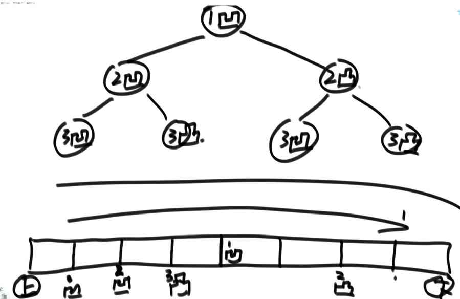

  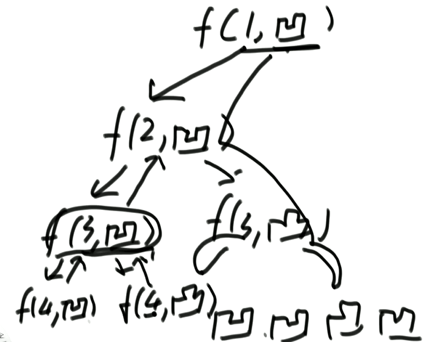

  ```java
  /**
   * @version 0.1
   * @Author hyx
   * @className Code08_PaperFolding
   * @Date 2024/11/4  17:41
   * @description 写出折纸的折痕方向
   * @since jdk 11
   */
  public class Code08_PaperFolding {
  
      public static void printAllFolds(int N) {
          printProcess(1, N, true);
      }
  
      // 递归过程，来到了某一个节点
      // i 是节点的层数，N一共的层数，down == true 凹  down == false 凸
      private static void printProcess(int i, int N, boolean down) {
          if (i > N) return;
          printProcess(i + 1, N, true);
          System.out.println(down ? "凹" : "凸");
          printProcess(i + 1, N, false);
  
      }
  
      public static void main(String[] args) {
          int n = 3;
          printAllFolds(n);
      }
  }
  ```


#### 3.6.2 二叉树的递归套路（重要）

- 可以解决面试中绝大多数的二叉树问题尤其是树型dp问题

  本质是利用递归遍历二叉树的便利性

1. 假设以X节点为头，假设可以向X左树和X右树要任何信息
2. 在上一步的假设下，讨论以X为头节点的树，得到答案的可能性(最重要)
3. 列出所有可能性后，确定到底需要向左树和右树要什么样的信息
4. 把左树信息和右树信息求全集，就是任何一棵子树都需要返回的信息S
5. 递归函数都返回S，每一棵子树都这么要求
6. 写代码，在代码中考虑如何把左树的信息和右树信息整合出整棵树的信息

#### 3.6.3 二叉树的递归套路（实践）P8

- 给定一棵二叉树的头节点head，返回这颗二叉树是不是平衡二叉树

  ```java
  public class Code01_IsBalanced {
  
  
      /**
       * 判断是否平衡
       * @param head head
       * @return isBalanced
       */
      public static boolean isBalanced2(Node head) {
          return process2(head).isBalanced;
      }
  
      public static Info process2(Node node){
          if (node == null){
              return new Info(true,0);
          }
          Info left = process2(node.left);
          Info right = process2(node.right);
          int height = Math.max(left.height, right.height) + 1;
          boolean isBalanced = left.isBalanced && right.isBalanced && Math.abs(left.height - right.height) <= 1;
          return new Info(isBalanced,height);
      }
  
      public static class Info{
          private boolean isBalanced;
          private int height;
  
          public Info() {
          }
  
          public Info(boolean isBalanced, int height) {
              this.isBalanced = isBalanced;
              this.height = height;
          }
      }
  
      public static class Node {
          private Node left;
          private Node right;
  
          public Node() {
          }
  
          public Node(Node left, Node right) {
              this.left = left;
              this.right = right;
          }
      }
  }
  ```

- 给定一棵二叉树的头节点head，任何两个节点之间都存在距离，返回整棵二叉树的最大距离

  ```java
      /*
           给定一棵二叉树的头节点head，任何两个节点之间都存在距离，返回整棵二叉树的最大距离
           两种情况：
               1. 过 x 点，返回左树的高度和左树的高度
               2. 不过 x 点，返回左树和右树中的最高高度
       */
      public static int maxDistance2(Node head){
          return process(head).maxDistance;
      }
      
      public static Info process(Node x) {
          if (x == null) return new Info(0, 0);
          Info leftInfo = process(x.left);
          Info rightInfo = process(x.right);
          int height = Math.max(leftInfo.height, rightInfo.height) + 1;
          int maxDistance = Math.max(
                  Math.max(leftInfo.maxDistance, rightInfo.maxDistance),
                  leftInfo.height + rightInfo.height + 1);
          return new Info(maxDistance, height);
      }
  
      public static class Info {
          private int maxDistance;
          private int height;
  
          public Info(int maxDistance, int height) {
              this.maxDistance = maxDistance;
              this.height = height;
          }
      }
  
      public static class Node {
          private Node left;
          private Node right;
  
          public Node() {
          }
  
          public Node(Node left, Node right) {
              this.left = left;
              this.right = right;
          }
      }
  }
  
  ```

- 给定一棵二叉树的头节点head，返回这颗二叉树中最大的二叉搜索子树的个数

  ```java
  public class Code03_MaxSubBSTSize {
  
      /*
          给定一棵二叉树的头节点head，返回这颗二叉树中最大的二叉搜索子树的个数
          情况：
              1、与头节点无关，返回左右子树中二叉搜索树的大小中的最大者
              2、与头节点有关，判断左右两个子树是否是二叉搜索树，左子树的 max < head.val 右子树的 min > head.val
          需要的变量；1、是否是二叉搜索树 2、二叉搜索树的个数 3、子树中的最大值 4、子树中的最小值
       */
      public static int getBSTSize(Node head) {
          return process(head).maxSubBSISize;
      }
  
      public static Info process(Node x) {
          if (x == null) {
              return null; // 这里判空，后面也要做出相应非空的判断
          }
          Info leftInfo = process(x.left);
          Info rightInfo = process(x.right);
  
          int maxSubBSISize = 0;
          // 1、与头节点无关，返回左右子树中二叉搜索树的大小中的最大者
          if (leftInfo != null) {
              maxSubBSISize = leftInfo.maxSubBSISize;
          }
          if (rightInfo != null) {
              maxSubBSISize = Math.max(maxSubBSISize, rightInfo.maxSubBSISize);
          }
  
          boolean isAllBST = false;
          // 如果可能性2成立，
          // maxSubBSISize = 以 x 为头节点的节点树     isAllBST = true
          if (
              // 左右整体需要是搜索二叉树
                  (leftInfo == null ? true : leftInfo.isAllBST) && (rightInfo == null ? true : rightInfo.isAllBST) &&
                          // 左子树的 max < head.val 右子树的 min > head.val
                          (leftInfo == null ? true : leftInfo.max < x.val) && (rightInfo == null ? true : rightInfo.min > x.val)
          ) {
              maxSubBSISize = (leftInfo == null ? 0 : leftInfo.maxSubBSISize) + (rightInfo == null ? 0 : rightInfo.maxSubBSISize) + 1;
              isAllBST = true;
          }
  
          int min = x.val;
          int max = x.val;
          if (leftInfo != null) {
              min = Math.min(min, leftInfo.min);
              max = Math.max(max, leftInfo.max);
          }
          if (rightInfo != null) {
              min = Math.min(min, rightInfo.min);
              max = Math.max(max, rightInfo.max);
          }
          return new Info(isAllBST, maxSubBSISize, min, max);
      }
  
      public static class Info {
          public boolean isAllBST;
          public int maxSubBSISize;
          public int min;
          public int max;
  
          public Info(boolean isAllBST, int maxSubBSISize, int min, int max) {
              this.isAllBST = isAllBST;
              this.maxSubBSISize = maxSubBSISize;
              this.min = min;
              this.max = max;
          }
      }
  
      public static class Node {
          private int val;
          private Node left;
          private Node right;
  
          public Node() {
          }
  
          public Node(int val) {
              this.val = val;
          }
      }
  }
  
  ```

- 派对的最大快乐值

  员工信息的定义如下:

  ```java
  class Employee {
      public int happy; //这名员工可以带来的快乐值
      List<Employee>subordinates; //这名员工有哪些直接下级
  }
  ```

  公司的每个员工都符合 Employee 类的描述。整个公司的人员结构可以看作是一棵标准的、没有环的多叉树。树的头节点是公司唯一的老板。除老板之外的每个员工都有唯一的直接上级。叶节点是没有任何下属的基层员工(subordinates列表为空)，除基层员工外，每个员工都有一个或多个直接下级。

  这个公司现在要办party，你可以决定哪些员工来，哪些员工不来，规则:

  1. 如果某个员工来了，那么这个员工的所有直接下级都不能来

  2. 派对的整体快乐值是所有到场员工快乐值的累加

  3. 你的目标是让派对的整体快乐值尽量大

     给定一棵多叉树的头节点boss，请返回派对的最大快乐值。

  情况：

  假设 x 节点下有 a，b，c 三个直接下属。

  1. 如果 x 来，一定获得 x.happy，那么 a、b、c 一定不来，返回 a、b、c 不来时整棵树的最大快乐值。

     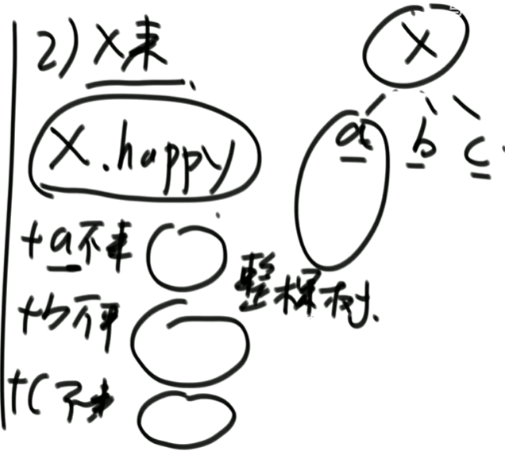

  2. 如果 x 不来，那么 a、b、c 可能来也可能不来，返回 a、b、c 来时整棵树的最大快乐值和 不来时整棵树的最大快乐值的**中的最大值的和。**

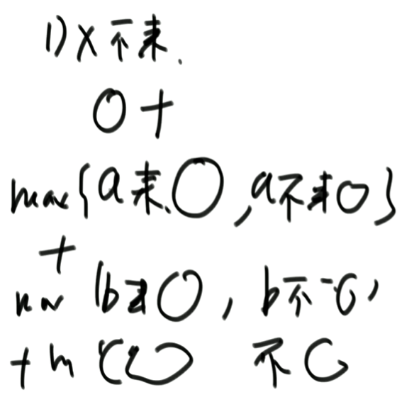

```java
public class Code04_MaxHappy {
    
    public static Info process2(Employee x) {
        if (x.nexts.isEmpty()) {
            return new Info(x.happy, 0);
        }
        int yes = x.happy;
        int no = 0;
        for (Employee next : x.nexts) {
            Info nextInfo = process2(next);
            yes += nextInfo.no;
            no += Math.max(nextInfo.yes, nextInfo.no);
        }
        return new Info(yes, no);
    }

    public static class Info {
        private int yes; // 头节点在来时的最大快乐值
        private int no; // 头节点在不来时的最大快乐值

        public Info(int yes, int no) {
            this.yes = yes;
            this.no = no;
        }
    }

    static class Employee {
        public int happy; //这名员工可以带来的快乐值
        List<Employee> nexts; //这名员工有哪些直接下级
    }
}
```


## 4. 递归

- 例子：

  求数组arr[L..R]中的最大值，怎么用递归方法实现。

  1)将[L..R]范围分成左右两半。左:[L..Mid]右[Mid+1..R]

  2)左部分求最大值，右部分求最大值

  3)[L..R]范围上的最大值，是max{左部分最大值，右部分最大值)

  注意:2)是个递归过程，当范围上只有一个数，就可以不用再递归了

  ```java
  // 求arr中的最大值
  public int getMax(int[] arr)P{
      return process(arr, 0, arr.length - 1);
  }
  // arr[L...R]范围上求最大值
  public int process(int[] arr, int L, int R){
      if(L == R){
          return arr[L];m'k'k
      }
      int mid = L + ((R - L) >> 1); // 中点
      int leftMax = process(arr, L, mid);
      int rightMax = process(arr, mid + 1, R);
      return Math.max(leftMax, rightMax);
  }
  ```


### 4.1 Master公式

形如：

T(N) = a * T(N/b) + O(N^d) (其中的a、b、d都是常数)的递归函数，可以直接通过 Master 公式来确定时间复杂度

如果 log(b,a) < d ,复杂度为O(N^d)

如果 log(b,a) > d ,复杂度为O(N^log(b,a))

如果 log(b,a) = d ,复杂度为O(N^d * logN)


## 5. 打表法

1) 问题如果返回值不太多，可以用hardcode的方式列出，作为程序的一部分
2) 一个大问题解决时底层频繁使用规模不大的小问题的解，如果小问题的返回值满足条件 1)，可以把小问题的解列成一张表，作为程序的一部分
3) 打表找规律 (本节课重点)，有关 1) 和 2) 内容欢迎关注后序课程

### 打表找规律

1) 某个面试题，输入参数类型简单，并且只有一个实际参数
2) 要求的返回值类型也简单，并且只有一个
3) 用暴力方法，把输入参数对应的返回值，打印出来看看，进而优化code

### 题目一

小虎去买苹果，商店只提供两种类型的塑料袋，每种类型都有任意数量。

1) 能装下6个苹果的袋子
2) 能装下8个苹果的袋子

小虎可以自由使用两种袋子来装苹果，但是小虎有强迫症，他要求自己使用的袋子数量必须最少，且使用的每个袋子必须装满。
给定一个正整数N，返回至少使用多少袋子。如果N无法让使用的每个袋子必须装满，返回-1。

```java
 // 打表法的技巧：先用暴力破解解决，然后观察其规律
    public static int minBags(int apple) {
        if (apple < 0) {
            return -1;
        }
        int bag6 = -1;
        int bag8 = apple / 8;
        int rest = apple - 8 * bag8;
        while (bag8 >= 0 && rest < 24) {
            int resUse6 = rest % 6 == 0 ? (rest / 6) : -1;
            if (resUse6 != -1) {
                bag6 = resUse6;
                break;
            }
            rest = apple - 8 * (--bag8);
        }
        return bag6 == -1 ? -1 : bag8 + bag6;
    }

    public static int minBagAwesome(int apple) {
        if ((apple & 1) != 0) { // 如果是奇数，返回 -1
            return -1;
        }
        if (apple < 18) {
            return apple == 0 ? 0 : (apple == 6 || apple == 8) ? 1 : (apple == 12 || apple == 14 || apple == 16) ? 2 : -1;
        }
        return (apple - 18) / 8 + 3;
    }

    public static void main(String[] args) {
        for (int apple = 0; apple <= 100; apple++) {
            System.out.println(apple + " : " + minBags(apple));
        }
    }
```


### 题目二

给定一个正整数N，表示有N份青草统一堆放在仓库里有一只牛和一只羊，牛先吃，羊后吃，它俩轮流吃草，不管是牛还是羊，每一轮能吃的草量必须是：1，4，16，64…(4的某次方)

谁最先把草吃完，谁获胜

假设牛和羊都绝顶聪明，都想赢，都会做出理性的决定

根据唯一的参数N，返回谁会赢

```java
	// n 份青草放在一堆
    // 先手后手都绝顶聪明
    // string "先手" "后手"
    public static String winner1(int n) { // 先手
        // 0  1  2  3 4
        // 后 先 后 先 先
        if (n < 5) {
            return (n == 0 || n == 2) ? "后手" : "先手";
        }
        // 当 n >= 5 时
        int base = 1; // 当前先手决定吃的草数
        // 当前是先手在选
        while (base <= n) {
            // 当前一共n份草，先手吃掉的是base份，n-base是留给后手
            if (winner1(n - base).equals("后手")) {
                return "先手";
            }
            if (base > n / 4) {
                break; // 防止 base * 4 溢出 ,Integer.maxValue * 4 = 负数，会出现不断循环的现象
            }
            base *= 4;
        }
        return "后手";
    }

    public static String winner2(int n) {
        if (n % 5 == 0 || n % 5 == 2) {
            return "后手";
        } else {
            return "先手";
        }
    }

    public static void main(String[] args) {
        for (int i = 0; i <= 100; i++) {
            System.out.println(i + " " + winner2(i));
        }
    }
```


### 题目三

定义一种数:可以表示成若干(数量>1)连续正数和的数

比如:

5=2+3，5就是这样的数
12=3+4+5，12就是这样的数
1不是这样的数，因为要求数量大于1个、连续正数和
2=1+1，2也不是，因为等号右边不是连续正数
给定一个参数N，返回是不是可以表示成若干连续正数和的数

```java
public static boolean isMSum1(int num) {
        for (int i = 1; i <= num; i++) {
            int sum = i;
            for (int j = i + 1; j <= num; j++) {
                if (sum + j > num) {
                    break;
                }
                if (sum + j == num) {
                    return true;
                }
                sum += j;
            }
        }
        return false;
    }

    // num 是不是2的某次方，
    // (num & (num - 1)) != 0 不是2的某次方
    public static boolean isMSum2(int num) {
        if (num < 3) {
            return false;
        }
        return (num & (num - 1)) != 0;
    }

    public static void main(String[] args) {
        for (int i = 0; i < 200; i++) {
            System.out.println(i + " : " + isMSum1(i));
        }
    }
```


## 6.矩阵处理技巧

1. zigzag 打印矩阵
2. 转圈打印矩阵
3. 原地旋转正方形矩阵

核心技巧：找到 coding 上的宏观调度


### 6.1 zigzag 打印矩阵

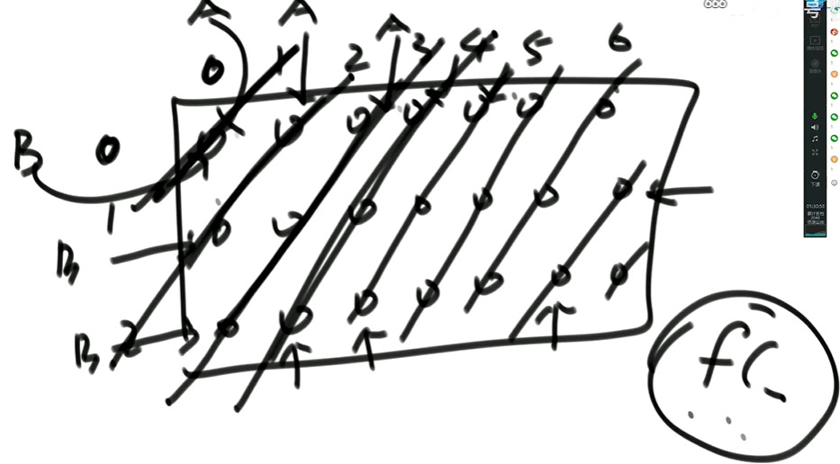

```java
public class Code04_ZigZagPrintMatrix {

    public static void printMatrixZigZag(int[][] matrix) {
        int Ar = 0; // A 的行
        int Ac = 0; // A 的列
        int Br = 0; // B 的行
        int Bc = 0; // B 的列
        int Endr = matrix.length - 1;
        int Endc = matrix[0].length - 1;
        boolean fromUp = false; // 是不是从右上往左下打印
        while (Ar != Endr + 1) {
            printLevel(matrix, Ar, Ac, Br, Bc, fromUp);
            Ar = Ac == Endc ? Ar + 1 : Ar;
            Ac = Ac == Endc ? Ac : Ac + 1;
            Bc = Br == Endr ? Bc + 1 : Bc;
            Br = Br == Endr ? Br : Br + 1;
            fromUp = !fromUp;
        }
        System.out.println();
    }

    private static void printLevel(int[][] matrix, int ar, int ac, int br, int bc, boolean fromUp) {
        if (fromUp) {
            while (ar != br + 1) {
                System.out.print(matrix[ar++][ac--] + " ");
            }
        } else {
            while (br != ar - 1) {
                System.out.print(matrix[br--][bc++] + " ");
            }
        }
    }

    public static void main(String[] args) {
        int[][] matrix = {{1, 2, 3, 4}, {5, 6, 7, 8}, {9, 10, 11, 12}};
        printMatrixZigZag(matrix);
    }

}

```


### 6.2 转圈打印矩阵

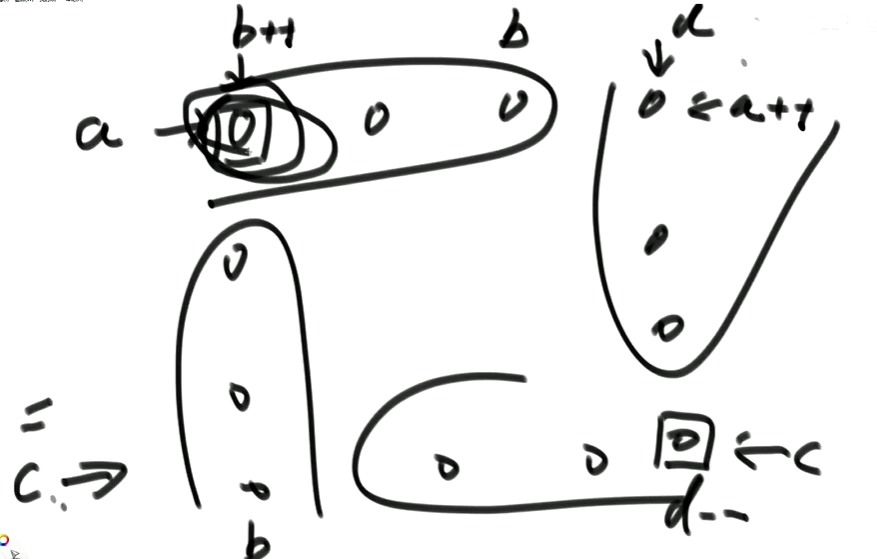


特殊情况：

1. 左上角点 和 右下角点 在同一行

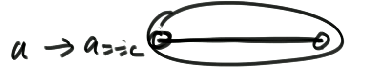

2. 左上角点 和 左下角点 在同一列

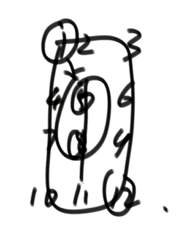

```java
    public static void spiralOrderPrint(int[][] matrix) {
        int tR = 0;
        int tC = 0;
        int dR = matrix.length - 1;
        int dC = matrix[0].length - 1;
        while (tR <= dR && tC <= dC) {
            printEdge(matrix, tR++, tC++, dR--, dC--);
        }
    }

    public static void printEdge(int[][] m, int a, int b, int c, int d) {
        // 左上角点 和 右下角点 在同一行
        if (a == c) {
            for (int i = b; i <= d; i++) {
                System.out.print(m[a][i] + " ");
            }
            // 左上角点 和 左下角点 在同一列
        } else if (b == d) {
            for (int i = a; i <= c; i++) {
                System.out.print(m[i][b] + " ");
            }
        } else {
            int curC = b;
            int curR = a;
            while (curC != d) {
                System.out.print(m[a][curC++] + " ");
            }
            while (curR != c) {
                System.out.print(m[curR++][d] + " ");
            }
            while (curC != b) {
                System.out.print(m[c][curC--] + " ");
            }
            while (curR != a) {
                System.out.print(m[curR--][b] + " ");
            }
        }
    }

    public static void main(String[] args) {
        int[][] matrix = {{1, 2, 3, 4}, {5, 6, 7, 8}, {9, 10, 11, 12}};
        spiralOrderPrint(matrix);
    }
```


### 6.3 原地旋转正方形矩阵

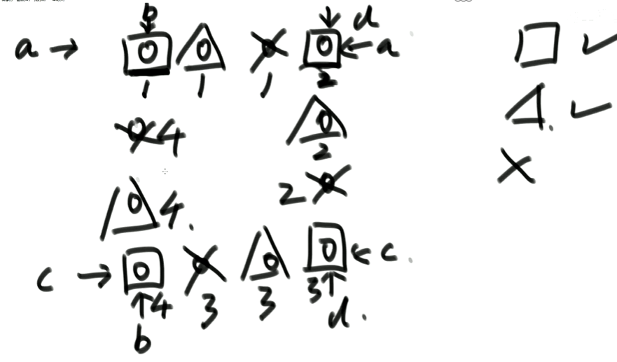

```java
public class Code06_PrintMatrix {

    public static void rotate(int[][] matrix) {
        int a = 0;
        int b = 0;
        int c = matrix.length - 1;
        int d = matrix[0].length - 1;
        while (a < c) {
            rotateEdge(matrix, a++, b++, c--, d--);
        }
    }

    private static void rotateEdge(int[][] m, int a, int b, int c, int d) {
        int temp = 0;
        for (int i = 0; i < d - b; i++) {
            temp = m[a][b + i];
            m[a][b + i] = m[c - i][b];
            m[c - i][b] = m[c][d - i];
            m[c][d - i] = m[a + i][d];
            m[a + i][d] = temp;
        }
    }

    private static void printMatrix(int[][] matrix) {
        for (int i = 0; i != matrix.length; i++) {
            for (int j = 0; i != matrix[0].length; j++) {
                 System.out.print(matrix[i][j] + " ");
            }
        }
    }

    public static void main(String[] args) {
        int[][] matrix = {{1, 2, 3, 4}, {5, 6, 7, 8}, {9, 10, 11, 12}, {13, 14, 15, 16}};
        rotate(matrix);
        printMatrix(matrix);
    }
}
```


## 7. 贪心算法

### 7.1 求解的标准过程

1. 分析业务
2. 根据业务逻辑找到不同的贪心策略
3. 对于能举出反例的策略直接跳过，不能举出反例的策略要证明有效性。这往往是特别困难的，要求数学能力很高且不具有统一的技巧性。


### 7.2 贪心算法的解题套路

1、实现一个不依靠贪心策略的解法X，可以用最暴力的尝试

2、脑补出贪心策略A、贪心策略B、贪心策略C.、

3、用解法X和对数器，用实验的方式得知哪个贪心策略正确

4、不要去纠结贪心策略的证明

  

## 8. 并查集

1. 有若干个样本a、b、c、d…类型假设是V
2. 在并查集中一开始认为每个样本都在单独的集合里
3. 用户可以在任何时候调用如下两个方法
   boolean isSameSet(Vx,Vy):查询样本x和样本y是否属于一个集合
   void union(Vx,Vy):把x和y各自所在集合的所有样本合并成一个集合
4. isSameSet和union方法的代价越低越好


## 9.图

1. 由点的集合和边的集合构成
2. 虽然存在有向图和无向图的概念，但实际上都可以用有向图来表达
3. 边上可能带有权值

### 9.1 图结构的表达

1. 邻接表法
2. 邻接矩阵法
3. 除此之外还有其他众多的方法


### 9.2 图的面试题如何搞定

图的算法都不算难，只不过coding的代价比较高

1) 先用自己最熟练的方式，实现图结构的表达
2) 在自己熟悉的结构上，实现所有常用的图算法作为模板
3) 把面试题提供的图结构转化为自己熟悉的图结构，再调用模板或改写即可


### 9.3 图的宽度优先&深度优先遍历

#### 9.3.1 宽度优先遍历(BFS)，使用优先级队列

1. 利用队列实现
2. 从源节点开始依次按照宽度进队列，然后弹出
3. 每弹出一个点，把该节点所有没有进过队列的邻接点放入队列
4. 直到队列变空


#### 9.3.2 深度优先遍历(DFS)，使用栈

1. 利用栈实现
2. 从源节点开始把节点按照深度放入栈，然后弹出
3. 每弹出一个点，把该节点下一个没有进过栈的邻接点放入栈
4. 直到栈变空


#### 9.3.3 图的拓扑排序算法（前提：有向无环图）

1) 在图中找到所有入度为0的点输出
2) 把所有入度为0的点在图中删掉，继续找入度为0的点输出，周而复始
3) 图的所有点都被删除后，依次输出的顺序就是拓扑排序

- 要求：有向图且其中没有环

- 应用：**事件安排、编译顺序**


#### 9.3.4 最小生成树算法之Kruskal

1) 总是从权值最小的边开始考虑，依次考察权值依次变大的边
2) 当前的边要么进入最小生成树的集合，要么丢弃
3) 如果当前的边进入最小生成树的集合中不会形成环，就要当前边
4) 如果当前的边进入最小生成树的集合中会形成环，就不要当前边
   
   考察完所有边之后，最小生成树的集合也得到了


#### ==9.3.5 Prim算法和Kruskal算法的主要区别在于它们构建最小生成树的方法、适用场景以及时间复杂度。==

##### Prim算法

Prim算法从任意一个顶点开始构造最小生成树。它初始化单个顶点为最小生成树的一部分，然后逐步扩展，每次添加一条连接已有树和图中其他顶点的最小边。Prim算法适用于稠密图，因为它查找最小边的速度较快，且每次添加的边不会形成环。该算法的核心在于维护一个顶点集合，从集合外的顶点中选取一条最小的边来扩展集合。‌

##### Kruskal算法

Kruskal算法从边的角度出发，选择权重最小的边加入到最小生成树中，但前提是这样做不会产生环。它对所有边进行排序，确保每次加入的都是目前能选择的最小边。Kruskal算法适用于稀疏图，其对边的处理更为高效。该算法需要处理环的问题，通常借助并查集数据结构。

**‌适用场景‌**：Prim算法适用于稠密图，因为它每次添加的是与已选顶点集合距离最近的顶点；而Kruskal算法适用于稀疏图，因为它每次选择的是所有未选边中权重最小的边。‌
**时间复杂度‌**：Prim算法的时间复杂度较高，因为它需要多次查找最小边；而Kruskal算法的时间复杂度较低，因为它只需要对边进行一次排序。‌

#### 9.3.6 Dijkstra算法

1) Dijkstra算法必须指定一个源点
2) 生成一个源点到各个点的最小距离表，一开始只有一条记录，即原点到自己的最小距离为0，源点到其他所有点的最小距离都为正无穷大
3) 从距离表中拿出没拿过记录里的最小记录，通过这个点发出的边，更新源点到各个点的最小距离表，不断重复这一步
4) 源点到所有的点记录如果都被拿过一遍，过程停止，最小距离表得到了


